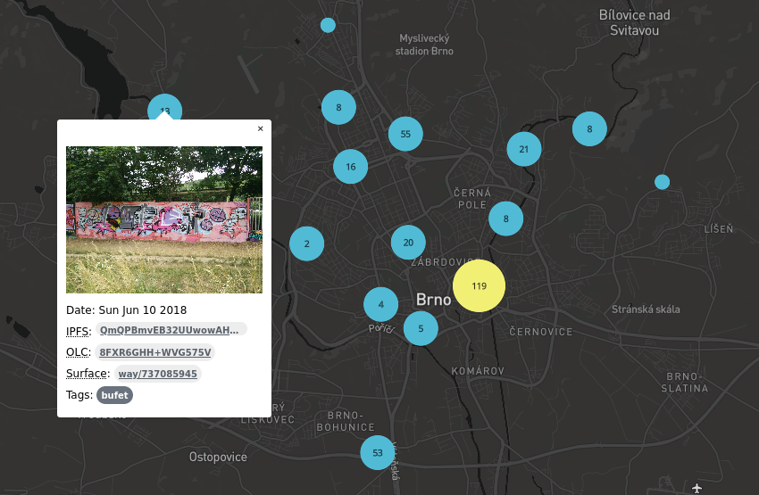

# Graffiti

Graffiti repository provides tools for any graffiti community around the world to keep track of street artwork in their areas.



## Features

### Distributed storage

The core of the project are geotagged photos stored in IPFS, meaning they are not stored in a central database, allowing users to only maintain the photos they are interested in. The data will be reachable as long as there is someone sharing them.

### Metadata

The maintained graffiti collection can be described by the users in [metadata](https://github.com/romanblanco/graffiti/blob/master/collection/graffiti.json), specifying OpenStreetMap node and tags for photos.

## Requirements

- Go (https://golang.org/)
- node.js (https://nodejs.org/)
- IPFS (https://ipfs.io/)

## Getting started

- GeoJSON data server: https://github.com/romanblanco/graffiti-ipfs/:

```
$ go get github.com/romanblanco/graffiti-ipfs
$ cd $GOPATH/bin
$ # TODO: cp ../src/github.com/romanblanco/graffiti-ipfs/source.json .
$ # TODO: update recources for data and metadata in source.json
$ cp ../src/github.com/romanblanco/graffiti-ipfs/graffiti.json .
$ ./graffiti-ipfs
```

- MapboxGl map displaying photos: https://github.com/romanblanco/graffiti-map/:

```
$ git clone https://github.com/romanblanco/graffiti.git
$ cd graffiti/
$ git submodule update --init --remote
$ cd graffiti-map/
$ git checkout master
$ npm install
$ npm run

```


## Learn more

- [Wiki](https://github.com/romanblanco/graffiti/wiki)
- [Task board](https://github.com/romanblanco/graffiti/projects)
